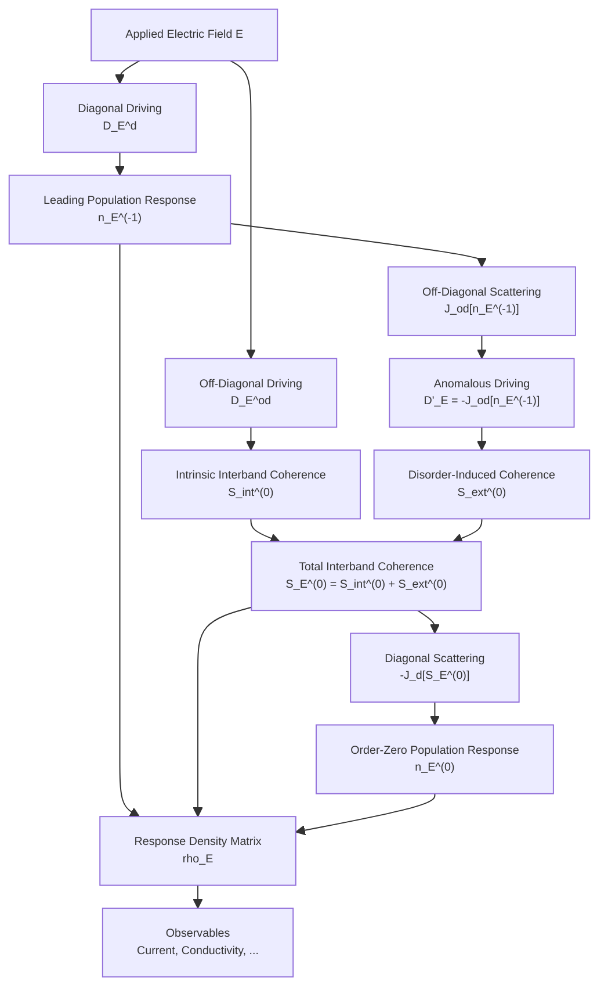
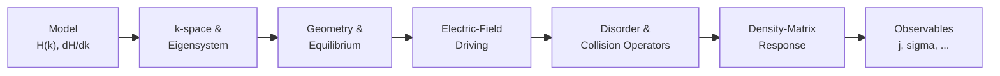

# Quantum Kinetic Theory of Electronic Transport in Multiband Systems
A Computational Framework for Interband Coherence, Disorder, and Electronic Response


## 1. Introduction

This repository develops a computational framework for quantum kinetic transport in multiband systems, with emphasis on interband coherence, disorder, and electric-field-driven response. Based on the density-matrix formalism of Culcer, Sekine, and MacDonald, the project aims to translate the analytical quantum kinetic theory into a modular numerical framework applicable to model Hamiltonians and, eventually, realistic material systems. The current implementation is benchmarked using the magnetic Rashba model and its anomalous Hall response.

Current status: Core linear-response quantum kinetic framework implemented through order (n_i^0) for nondegenerate multiband systems with energy-conserving Born scattering. Scalar and matrix-valued disorder are supported, with the present implementation benchmarked against the magnetic Rashba anomalous Hall problem.

## 2. Theory Overview

The framework describes electronic transport using the single-particle density matrix $\rho$, whose evolution in the presence of an electric field and disorder is governed by the quantum kinetic equation

$$
\frac{\partial \rho}{\partial t}
+\frac{i}{\hbar}[H,\rho]
+K(\rho)=0,
$$

where $H$ contains the crystal Hamiltonian and electric-field perturbation, while $K(\rho)$ describes disorder scattering.

In the band eigenstate basis, the electric-field-induced response naturally separates into

$$
\rho_E = n_E + S_E,
$$

where $n_E$ is band diagonal and describes changes in carrier populations, while $S_E$ is band off-diagonal and describes electric-field-induced interband coherence. The transport response is obtained by solving the coupled evolution of these two components while accounting for disorder scattering.

### 2.1 Response Hierarchy

In the weak-disorder limit, the band-diagonal response can be expanded in powers of the impurity density $n_i$,

$$
n_E = n_E^{(-1)} + n_E^{(0)} + \cdots,
$$

while the leading band-off-diagonal response is of order $n_i^0$,

$$
S_E = S_E^{(0)} + \cdots.
$$

The resulting response density matrix retained in the present implementation is

$$
\rho_E =
n_E^{(-1)}
+n_E^{(0)}
+S_{\mathrm{int}}^{(0)}
+S_{\mathrm{ext}}^{(0)}.
$$

Here, $n_E^{(-1)}$ is the leading disorder-dependent population response, $S_{\mathrm{int}}^{(0)}$ is the intrinsic interband coherence generated directly by the electric field, $S_{\mathrm{ext}}^{(0)}$ is the disorder-induced interband coherence generated through scattering of $n_E^{(-1)}$, and $n_E^{(0)}$ is the order-zero diagonal correction generated by the interband response.

This hierarchy allows intrinsic and disorder-induced transport mechanisms to be calculated within the same density-matrix framework.

### 2.2 Electric-Field Response

The response components are generated sequentially through electric-field driving and disorder scattering:



The two principal interband contributions have distinct physical origins:

- **Intrinsic response:** the electric field directly generates $S_{\mathrm{int}}^{(0)}$, connecting the transport response to the geometric structure of the Bloch states.
- **Disorder-induced response:** scattering of the leading population correction $n_E^{(-1)}$ generates an additional driving term $D'_E$, producing $S_{\mathrm{ext}}^{(0)}$.

The total response is assembled as

$$
\rho_E =
n_E^{(-1)}
+n_E^{(0)}
+S_{\mathrm{int}}^{(0)}
+S_{\mathrm{ext}}^{(0)},
$$

from which observables such as charge current and conductivity are evaluated.

### 2.3 Transport Observables

Once the response density matrix $\rho_E$ is obtained, the expectation value of an observable $\hat{O}$ is evaluated as

```math
\langle O \rangle
=
\sum_{\mathbf{k}} w_{\mathbf{k}}
\,\mathrm{Tr}\left[
\rho_E(\mathbf{k})\,O(\mathbf{k})
\right]
```

where $w_{\mathbf{k}}$ is the $k$-space integration weight.

For charge transport, the current is

```math
j_\alpha
=
-e
\sum_{\mathbf{k}} w_{\mathbf{k}}
\,\mathrm{Tr}\left[
\rho_E(\mathbf{k})\,v_\alpha(\mathbf{k})
\right]
```

with the velocity operator obtained from the Bloch Hamiltonian,

```math
v_\alpha
=
\frac{1}{\hbar}
\frac{\partial H}{\partial k_\alpha}.
```

The conductivity for an electric field applied along direction $\beta$ is then

```math
\sigma_{\alpha\beta}
=
\frac{j_\alpha}{E_\beta}.
```

Because $\rho_E$ is constructed from distinct diagonal, intrinsic, and disorder-induced contributions, the contribution of each physical mechanism to an observable can be evaluated independently before assembling the total response.

## 3. Conventions and Assumptions

The following conventions are used throughout the implementation:

- **Charge convention:** $e>0$ denotes the magnitude of the elementary charge. The physical electron charge is therefore $q=-e$, and the charge current is evaluated using $-e\,\mathbf{v}$.

- **Band basis:** Eigenstates are obtained from numerical diagonalization of $H(\mathbf{k})$ and stored as columns of the eigenvector matrix. Band indices follow ascending eigenenergy order.

- **Density-matrix decomposition:** $n_E$ denotes the band-diagonal response, while $S_E$ denotes the band-off-diagonal (interband-coherence) response.

- **Conductivity indices:** Internally, $\sigma_{\alpha\beta}=j_\alpha/E_\beta$, where the first index denotes the current direction and the second the electric-field direction. When comparing with a reference paper, its original notation is retained and explicitly identified where it differs.

- **Disorder regime:** Disorder is treated perturbatively in the weak-scattering **Born approximation**. The present implementation retains the energy-conserving part of the collision integral.

- **Energy conservation:** Dirac delta functions appearing in elastic scattering are represented numerically by normalized Gaussian broadening,

```math id="z7nx5i"
\delta_\eta(\epsilon)
=
\frac{1}{\sqrt{\pi}\eta}
\exp\left[-\left(\frac{\epsilon}{\eta}\right)^2\right].
```

- **Band degeneracy:** The present implementation assumes nondegenerate bands when constructing interband quantities containing energy denominators.

- **Momentum integration:** Brillouin-zone or model $k$-space integrals are evaluated on a uniform mesh using

```math id="oex74d"
\int \frac{d^d k}{(2\pi)^d}
\;\longrightarrow\;
\sum_{\mathbf{k}} w_{\mathbf{k}}.
```

- **Units:** Model parameters and numerical examples may use dimensionless/natural units, with $\hbar$ specified explicitly by each model. Physical-unit conversion is therefore kept separate from the core transport formalism.

## 4. Implementation Scope and Limitations

The current framework implements the linear-response quantum kinetic formalism through order $n_i^0$ for **nondegenerate multiband systems** in the weak-disorder regime.

### Current Scope

The implementation currently includes:

- Band-diagonal response $n_E^{(-1)}$ obtained from the disorder collision operator.
- Intrinsic interband coherence $S_{\mathrm{int}}^{(0)}$.
- Disorder-induced interband coherence $S_{\mathrm{ext}}^{(0)}$.
- Order-zero diagonal response $n_E^{(0)}$.
- Assembly of the complete implemented response density matrix $\rho_E$.
- Berry connection, Berry curvature, velocity, charge-current, and conductivity calculations.
- Scalar disorder $U_0 I$.
- Hermitian matrix-valued disorder acting in the internal orbital/spin space.
- A general disorder interface of the form $U(\mathbf{k},\mathbf{k}')$.

The current implementation has been quantitatively benchmarked using **scalar disorder in the magnetic Rashba anomalous Hall problem**. The generalized matrix-disorder implementation has additionally been validated by recovering the scalar limit and tested with momentum-independent Hermitian matrix disorder.

### Current Limitations and Open Numerical Issues

The following parts of the broader formalism are not yet implemented or fully validated:

- Principal-value contributions to the disorder collision integral.
- Degenerate-band and degenerate-subspace transport.
- Non-Abelian Berry connections required for general degenerate systems.
- Wannier-interpolated or first-principles electronic structures.
- Quantitative validation of momentum-dependent matrix disorder.
- Additional model Hamiltonians beyond the present Rashba benchmark.

The current implementation also has several numerical limitations and open issues:

- **Order-zero diagonal response:** The calculated $n_E^{(0)}$ contribution shows sensitivity to $k$-mesh resolution and scattering broadening and is not yet regarded as quantitatively converged.
- **Collision-operator null space:** The diagonal-response solver removes the global constant null mode. Additional near-null modes associated with approximately decoupled constant-energy shells may occur for elastic scattering and could contribute to the numerical sensitivity of $n_E^{(0)}$. This possibility remains to be investigated systematically.
- **Degeneracies:** Different numerical routines are not designed to provide a consistent treatment at exact band degeneracies. Calculations involving degenerate bands require a dedicated degenerate-subspace formulation.
- **Periodic Brillouin-zone meshes:** The present uniform $k$-mesh is designed for finite-cutoff continuum models. Periodic lattice or Wannier calculations will require a mesh that avoids double counting equivalent Brillouin-zone boundary points.
- **General disorder potentials:** The generalized disorder interface assumes, but does not currently enforce, the Hermiticity condition
  $U(\mathbf{k}',\mathbf{k}) = U^\dagger(\mathbf{k},\mathbf{k}')$.
- **Computational scaling:** Several disorder collision terms involve explicit $(\mathbf{k},\mathbf{k}')$ operations and scale approximately as $N_k^2$, limiting the mesh sizes that can currently be treated efficiently.


The framework is therefore intended to provide a **modular foundation for progressively extending the quantum kinetic formalism**, rather than a complete implementation of all multiband transport regimes.

## 5. Code Architecture

The code is organized so that the **electronic-structure model is independent of the transport solver**. A model provides $H(\mathbf{k})$ and its momentum derivatives, while the remaining modules construct the quantum kinetic response.

```text
quantum-kinetic-transport/
├── core/
│   ├── eigensystem.py
│   ├── equilibrium.py
│   ├── geometry.py
│   └── kspace.py
│
├── disorder/
│   ├── base.py
│   ├── collision.py
│   ├── matrix.py
│   ├── matrix_elements.py
│   ├── scalar.py
│   └── scattering.py
│
├── driving/
│   └── electric_field.py
│
├── models/
│   ├── base.py
│   └── rashba.py
│
├── observables/
│   ├── current.py
│   └── expectation.py
│
├── response/
│   ├── coherence.py
│   ├── density_matrix.py
│   └── diagonal.py
│
├── tests/
│   └── test_base.py
│
├── magnetic_rashba_ahe.py
├── requirements.txt
├── README.md
└── LICENSE
```

The calculation follows the modular pipeline:



The major modules have the following roles:

- **`models`** — defines Bloch Hamiltonians and their momentum derivatives.
- **`core`** — constructs the $k$-space mesh, eigensystem, equilibrium occupations, velocities, Berry connections, and Berry curvature.
- **`driving`** — constructs electric-field driving terms.
- **`disorder`** — defines disorder potentials and the associated collision operators.
- **`response`** — solves for the diagonal and interband components of the response density matrix.
- **`observables`** — evaluates physical quantities such as expectation values, charge current, and conductivity.
- **`examples`** — contains model-specific calculations and validation scripts without embedding model-specific physics into the core solver.

This separation allows additional Hamiltonians and disorder models to be introduced without rewriting the underlying transport machinery.

## 6. Running the Code

### 6.1 Environment Setup

It is recommended to run the project inside a Python virtual environment.

Create the environment:

```bash
python -m venv .venv
```

Activate it on **Linux / macOS**:

```bash
source .venv/bin/activate
```

or on **Windows**:

```bash
.venv\Scripts\Activate.ps1
```

Install the required dependencies:

```bash
pip install -r requirements.txt
```

The local `.venv/` directory is excluded from version control through `.gitignore`.


### 6.2 Running the Magnetic Rashba Benchmark

From the repository root, run:

```bash
python magnetic_rashba_ahe.py
```

The calculation constructs the $k$-space mesh, diagonalizes the Hamiltonian, evaluates the geometric quantities, constructs the disorder collision operators, solves the kinetic equations, assembles the response density matrix, and evaluates the resulting transport observables.


### 6.3 Main Parameters

The magnetic Rashba benchmark is controlled by the following physical and numerical parameters:

| Parameter | Description |
|---|---|
| `effective_mass` | Effective electron mass $m^*$ |
| `alpha` | Rashba spin-orbit coupling $\alpha$ |
| `magnetization` | Exchange/magnetization parameter $M$ |
| `mu` | Chemical potential $\mu$ |
| `electric_field` | Applied electric field $\mathbf{E}$ |
| `MESH_SHAPE` | Number of $k$ points along each momentum direction |
| `ETA_FERMI` | Broadening used for the Fermi-surface delta function |
| `ETA_SCATTERING` | Broadening used for energy conservation in elastic scattering |
| `DISORDER_TYPE` | Selects scalar or matrix-valued disorder |
| `impurity_density` | Disorder impurity density $n_i$ |
| `RUN_N0_DIAGNOSTIC` | Enables the order-zero diagonal-response calculation |
| `RUN_GENERAL_DISORDER_VALIDATION` | Compares the generalized and scalar collision operators |

Increasing `MESH_SHAPE` generally improves numerical convergence, but substantially increases the computational cost of evaluating the disorder collision operator.


### 6.4 Output

The benchmark produces several groups of numerical and physical diagnostics:

- **General disorder operator — scalar regression:** verifies that the generalized collision operator reproduces the optimized scalar-disorder implementation.

- **Core numerical checks:** reports Berry-curvature accuracy, kinetic-equation residuals, Hermiticity, and independent density-matrix/current consistency checks.

- **Magnetic Rashba analytical benchmark:** compares the numerical intrinsic and disorder-induced Hall responses with the analytical results of the reference theory.

- **Interband AHE benchmark:** evaluates the cancellation between intrinsic and disorder-induced interband Hall contributions.

- **Order-zero response:** solves and reports the $n_E^{(0)}$ contribution separately from the Rashba interband benchmark.

- **Assembled response density matrix:** evaluates the total current and conductivity directly from the complete implemented response $\rho_E$.

- **Hall-response decomposition:** separates the contributions from $n_E^{(-1)}$, $S_{\mathrm{int}}^{(0)}$, $S_{\mathrm{ext}}^{(0)}$, and $n_E^{(0)}$, and verifies that their sum reproduces the response calculated from the assembled density matrix.

The output is designed to expose both the resulting transport coefficients and the numerical consistency of each stage of the quantum kinetic calculation.

## 7. Implementation and Validation Results

The implementation was validated using the magnetic Rashba anomalous Hall problem on a $51\times51$ momentum mesh. The benchmark tests both the physical response predicted by the theory and the numerical consistency of the framework.

### 7.1 Berry Geometry and Numerical Consistency

The numerically evaluated Berry curvature agrees with the analytical magnetic Rashba result to near machine precision:

| Check | Result |
|---|---:|
| Maximum Berry-curvature error | $1.95\times10^{-14}$ |
| $n_E^{(-1)}$ kinetic residual | $4.44\times10^{-11}$ |
| $S_{\mathrm{int}}$ Hermiticity error | $1.51\times10^{-14}$ |
| $S_{\mathrm{ext}}$ Hermiticity error | $1.78\times10^{-15}$ |
| Density-matrix / Berry intrinsic difference | $1.74\times10^{-18}$ |
| Current-observable consistency | $2.28\times10^{-20}$ |

The agreement between the independently evaluated density-matrix and Berry-curvature intrinsic responses provides an additional check on the implementation of the interband-coherence formalism.


### 7.2 Scalar and Generalized Disorder Operators

The generalized matrix-valued disorder collision operator was tested in its scalar limit against the independently implemented optimized scalar collision operator.

For the $51\times51$ calculation,

```text id="n9l3ek"
max |J_scalar - J_general| = 1.67e-16
relative difference        = 3.27e-16
```

demonstrating agreement to machine precision.


### 7.3 Magnetic Rashba Anomalous Hall Response

Throughout this repository, conductivity indices follow
$\sigma_{\alpha\beta}=j_\alpha/E_\beta$. Thus, for an electric field applied along $x$, the transverse response calculated from $j_y/E_x$ is denoted $\sigma_{yx}$.

The reference paper denotes the corresponding Hall response as $\sigma_{xy}$. The paper's notation is retained below only when referring explicitly to its analytical equations.

For the benchmark parameters,

```math
\frac{M}{\alpha k_F}\approx0.1,
\qquad
\frac{\alpha k_F}{\mu}\approx0.1,
```

placing the calculation in the regime used to obtain the weak-$M$ analytical results of the reference paper.

The numerical intrinsic Hall response is

```math
\sigma_{yx}^{\mathrm{int}}
=
+7.99818\times10^{-4},
```

compared with the analytical result reported in Eq. (69),

```math
\sigma_{xy}^{(69)}
=
+7.85970\times10^{-4},
```

corresponding to a relative difference of **1.76%**.

The numerical disorder-induced Hall response is

```math
\sigma_{yx}^{\mathrm{ext}}
=
-7.91100\times10^{-4},
```

compared with the analytical result reported in Eq. (74),

```math
\sigma_{xy}^{(74)}
=
-7.85970\times10^{-4},
```

corresponding to a relative difference of **0.65%**.

The comparison is summarized below:

| Contribution | Reference-paper result | Numerical result | Relative Difference |
|---|---:|---:|---:|
| Intrinsic — Eq. (69), $\sigma_{xy}$ | $+7.85970\times10^{-4}$ | $\sigma_{yx}^{\mathrm{int}}=+7.99818\times10^{-4}$ | 1.76% |
| Disorder-induced — Eq. (74), $\sigma_{xy}$ | $-7.85970\times10^{-4}$ | $\sigma_{yx}^{\mathrm{ext}}=-7.91100\times10^{-4}$ | 0.65% |


### 7.4 Intrinsic–Extrinsic Cancellation

In the weak-$M$ limit, Eq. (75) predicts cancellation of the intrinsic and disorder-induced interband Hall responses:

```math id="syew1x"
\sigma_{xy}^{\mathrm{int}}
+
\sigma_{xy}^{\mathrm{ext}}
\rightarrow 0.
```

Numerically,

```math id="as1nvs"
\sigma_{xy}^{\mathrm{int}}
+
\sigma_{xy}^{\mathrm{ext}}
=
8.7182\times10^{-6}.
```

This corresponds to **98.91% cancellation** between the two independently calculated contributions.

This cancellation provides a particularly sensitive benchmark because the intrinsic and disorder-induced responses originate from different parts of the kinetic equation but must approach equal magnitudes with opposite signs in the analytical limit.


### 7.5 Order-Zero Diagonal Response

The order-zero diagonal response $n_E^{(0)}$ is obtained independently from Eq. (49). For the $51\times51$ calculation,

```text
maximum Eq. (49) residual = 5.39e-14
sum n^(0)                 = 2.71e-15
```

showing a small kinetic-equation residual together with a vanishing net population correction to numerical precision.

The resulting transverse contribution is

```math
\sigma_{yx}[n_E^{(0)}]
=
-3.15395\times10^{-5}.
```

This term is reported separately from the Rashba Eqs. (68)–(75) interband benchmark. Its magnitude is sensitive to numerical resolution in the present calculations and is therefore not treated as quantitatively converged. Its role in the complete Rashba Hall response remains under investigation.


### 7.6 Full Density-Matrix Response

The implemented response density matrix is assembled as

```math id="p5djrr"
\rho_E
=
n_E^{(-1)}
+
n_E^{(0)}
+
S_{\mathrm{int}}^{(0)}
+
S_{\mathrm{ext}}^{(0)}.
```

For the $51\times51$ calculation, its Hermiticity error is

```math id="ekvmb1"
1.53\times10^{-14}.
```

The transverse conductivity decomposes as

| Response component | $\sigma_{yx}$ |
|---|---:|
| $n_E^{(-1)}$ | $+2.85\times10^{-18}$ |
| $S_{\mathrm{int}}^{(0)}$ | $+7.99818\times10^{-4}$ |
| $S_{\mathrm{ext}}^{(0)}$ | $-7.91100\times10^{-4}$ |
| $n_E^{(0)}$ | $-3.15395\times10^{-5}$ |
| **Full $\rho_E$** | **$-2.28213\times10^{-5}$** |

The independently evaluated contributions reproduce the conductivity obtained directly from the assembled density matrix with a closure error of

```math id="22mvlg"
2.78\times10^{-17}.
```

## 8. Notes and Issues Identified in the Reference Literature

Implementation of the full response hierarchy exposed a few points in the reference treatment that require particular care when translating the analytical formalism into a numerical framework.

### 8.1 Sign Consistency in the Magnetic Rashba AHE Benchmark

The magnetic Rashba bands are defined as

```math
\epsilon_k^\pm
=
\frac{\hbar^2 k^2}{2m^*}
\pm
\lambda_k,
\qquad
\lambda_k=\sqrt{\alpha^2k^2+M^2}.
```

For positive $\alpha$, these definitions give

```math
k_{F+}<k_{F-}.
```

Evaluating Eq. (68) literally with these band definitions produces an intrinsic Hall conductivity with a sign opposite to the weak-$M$ expression subsequently given in Eq. (69).

The later analytical expressions give

```math
\sigma_{xy}^{(69)}
=
+
\frac{e^2}{2h}
\frac{2\alpha^2m^*M}
{\hbar^2\lambda_{k_F}^2},
```

and

```math
\sigma_{xy}^{(74)}
=
-
\frac{e^2}{2h}
\frac{2\alpha^2m^*M}
{\hbar^2\lambda_{k_F}^2}.
```

These have equal magnitude and opposite sign, consistent with the cancellation stated in Eq. (75):

```math
\sigma_{xy}^{(69)}+\sigma_{xy}^{(74)}=0.
```

The numerical implementation independently produces the same sign structure: a **positive intrinsic** and **negative disorder-induced** Hall response. The intrinsic density-matrix result is additionally verified against an independent Berry-curvature calculation.

For transparency, the implementation therefore reports Eq. (68) literally as printed, while Eqs. (69) and (74) are used for the weak-$M$ numerical benchmark and Eq. (75) cancellation test.


### 8.2 Order-Zero Diagonal Response in the Rashba Evaluation

The general quantum kinetic formalism contains an order-$n_i^0$ band-diagonal response $n_E^{(0)}$, determined through Eq. (49),

```math
J_d[n_E^{(0)}]
=
-J_d[S_E^{(0)}],
```

where

```math
S_E^{(0)}
=
S_{\mathrm{int}}^{(0)}
+
S_{\mathrm{ext}}^{(0)}.
```

However, in the magnetic Rashba anomalous Hall evaluation of Sec. VII.B, the reported Hall response leading to Eqs. (68)–(75) is constructed from the intrinsic and disorder-induced **interband** contributions. The corresponding $n_E^{(0)}$ contribution is not explicitly evaluated in the worked Rashba result.

The present implementation retains the general Eq. (49) response rather than omitting it. Numerically, the equation is solved with a small kinetic residual, while $n_E^{(0)}$ produces a finite transverse response. It is therefore reported separately from the Eqs. (68)–(75) interband benchmark.

This distinction is important:

```math
\underbrace{
S_{\mathrm{int}}^{(0)}
+
S_{\mathrm{ext}}^{(0)}
}_{\text{Rashba Eqs. (68)--(75) benchmark}}
\qquad \neq \qquad
\underbrace{
n_E^{(0)}
+
S_{\mathrm{int}}^{(0)}
+
S_{\mathrm{ext}}^{(0)}
}_{\text{complete implemented order-}n_i^0\text{ response}}.
```

At present, the finite $n_E^{(0)}$ transverse contribution is treated as an **open theoretical/implementation point rather than as an error in the reference paper**. Further analytical investigation is required to determine its role in the complete magnetic Rashba Hall response.

## 9. Future Work

The present implementation establishes the core density-matrix quantum kinetic framework and its first numerical benchmark. Planned extensions include:

- **Extension to subsequent quantum kinetic formulations** developed in the follow-up works to the present reference.
- **Principal-value collision terms**, extending the current energy-conserving Born collision operator.
- **Degenerate-band transport**, including the corresponding non-Abelian and gauge-covariant treatment of band subspaces.
- **Additional model Hamiltonians** to test the framework beyond the magnetic Rashba system.
- **Momentum-dependent and more general matrix disorder** models.
- **Additional transport observables**, including spin and other operator-resolved responses.
- **Wannier-based electronic structures**, allowing the same transport machinery to operate on realistic multiband Hamiltonians.
- **First-principles integration**, providing a path from DFT-derived electronic structure to quantum kinetic transport calculations.

The long-term objective is to develop the repository from an implementation of analytically tractable model systems into a reusable computational framework for studying **intrinsic and disorder-mediated transport in realistic quantum materials**.

## 10. References

### Primary Reference

1. D. Culcer, A. Sekine, and A. H. MacDonald,  
   **“Interband coherence response to electric fields in crystals: Berry-phase contributions and disorder effects,”**  
   *Physical Review B* **96**, 035106 (2017).  
   DOI: `10.1103/PhysRevB.96.035106`

### Related Work

Additional references corresponding to subsequent extensions of the quantum kinetic formalism will be added as they are implemented and validated within this repository.
